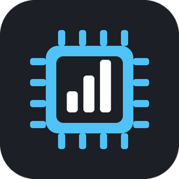
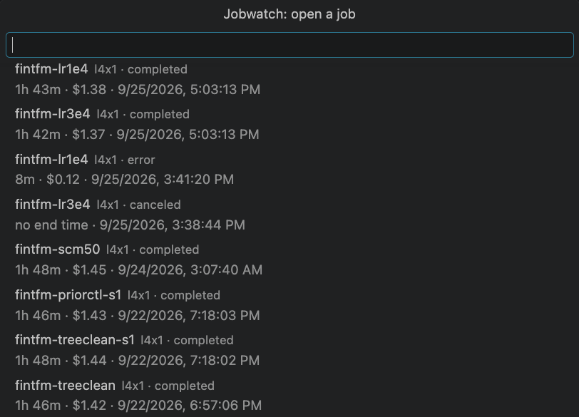

<p align="center">
  
</p>

<h1 align="center">Jobwatch</h1>

<p align="center">
  <strong>Your Hugging Face Jobs and what they cost, live in the VS Code status bar.</strong><br>
  Know when a job fails, runs out of memory, nears its timeout or sits in the queue, without keeping a tab open.
</p>

<p align="center">
  <a href="https://github.com/kabartay/jobwatch/actions/workflows/ci.yml"></a>
  <a href="https://github.com/kabartay/jobwatch/releases/latest"></a>
  <a href="LICENSE"></a>
  <a href="package.json"></a>
  <a href="tsconfig.json"></a>
  <a href="package.json"></a>
  <a href="#caveats"></a>
</p>

## At a glance

```text
$(pulse) 2 running · 1 queued · $1.84          while jobs are active: what it has cost so far
$(server-process) $12.40 this month            when nothing is running
```

Hover for every active job and the latest finished ones. Click to pick any job and open its page:

<p align="center">
  
</p>

## Why

GPU time is billed by the minute, and the expensive mistakes are the quiet ones: a job that died
of out-of-memory five minutes in while you waited for it, one stuck in the queue for an hour, one
about to be killed at its time limit with no checkpoint, one left running overnight. Jobwatch
watches for each of them and tells you once.

## What it tells you

Each alert fires once per job, with a button to open it. Installing Jobwatch is quiet: jobs that
finished before are recorded, not announced.

| When | You see |
| --- | --- |
| A job is killed for memory | *fintfm-s1 ran out of memory on a10g-small after 5m, about $0.09.* |
| A job fails another way | *fintfm-s1 failed after 2m: Job failed with exit code: 1.* |
| A job completes | *fintfm-s1 completed after 1h 12m, about $1.20.* (can be turned off) |
| A job nears its own time limit | *fintfm-s1 will hit its 2h 00m timeout in 12m and be stopped.* |
| A job waits for hardware | *fintfm-s1 has waited 25m for a10g-large hardware without starting.* |
| Spend passes your budget | *Estimated Hugging Face Jobs spend this month is $51.20, past your $50.00 budget.* (once a month) |

## How cost is estimated

Running time × the hardware's per-minute price from Hugging Face's own price list. Running time
comes from the best source available, and the display says which:

| Job | Shown as |
| --- | --- |
| Running | time so far, measured live: `1h 05m · $1.08` |
| Finished, time reported | `5m · $0.09` |
| Cancelled while Jobwatch was watching | from the last time it saw the job running, a lower bound: `≥ 40m · ≥ $0.67` |
| Cancelled before Jobwatch saw it | Hugging Face records no end time, so the most it could have cost, from its time limit: `no end time · up to $4.00` |

These are estimates; your Hugging Face invoice is the authority.

## Features

- **Zero setup.** Uses the token the `hf` CLI already stored. Nothing to paste.
- **Read-only.** It never starts, stops or changes a job.
- **Light.** Polls every minute while something is queued or running, every ten minutes
  otherwise, backs off when asked, and refreshes when you return to the window.
- **Your whole history.** Follows the job list across pages, so totals include every job.
- **No runtime dependencies, no telemetry.**

## Install

**Requirements:** VS Code 1.85 or newer, and a Hugging Face token: run `hf auth login` once, or
set `HF_TOKEN`.

1. In VS Code, open Extensions, search **Jobwatch**, and click **Install**.
2. Or download the `.vsix` from [Releases](https://github.com/kabartay/jobwatch/releases) and
   use **Extensions → ··· → Install from VSIX…**.

The status bar item appears within a few seconds.

## Commands

| Command | Does |
| --- | --- |
| **Jobwatch: Refresh Jobs** | Refreshes now |
| **Jobwatch: Open a Job…** | Lists recent jobs and opens the one you pick (also: click the status bar) |
| **Jobwatch: Show Log** | Opens the log |

## Settings

| Setting | Default | Meaning |
| --- | --- | --- |
| `jobwatch.monthlyBudgetUsd` | `0` | Warn once a month past this estimated spend; `0` is off |
| `jobwatch.notifyOnComplete` | `true` | Notify when a job completes; failures always notify |
| `jobwatch.timeoutWarningMinutes` | `15` | Warn this many minutes before a job's own timeout; `0` is off |
| `jobwatch.queueWarningMinutes` | `20` | Warn when a job has waited this long for hardware; `0` is off |
| `jobwatch.pollSecondsActive` | `60` | Refresh interval while a job is queued or running (minimum 30) |
| `jobwatch.pollSecondsIdle` | `600` | Refresh interval otherwise (minimum 120) |
| `jobwatch.namespace` | `""` | Watch an organisation's jobs instead of your own |

## Privacy

The token is read from `HF_TOKEN` or the `hf` CLI's token file, sent only to `huggingface.co`,
and never written or logged. Jobwatch reads three endpoints (your account name, your jobs, the
hardware price list), keeps nothing but which alerts it has shown and when it last saw each job
running, and has no telemetry. Job environment variables and secrets are never read.

## Caveats

- **Unofficial.** Not affiliated with Hugging Face. It uses the same endpoints as the `hf` CLI,
  which may change.
- **Costs are estimates**: running time × listed price. Your Hugging Face invoice is the
  authority.
- **Hugging Face Jobs only.**

## Documentation

- [Architecture](docs/ARCHITECTURE.md): layers, the provider interface, how cost is estimated
- [Development](docs/DEVELOPMENT.md): building, testing, releasing
- [Troubleshooting](docs/TROUBLESHOOTING.md): when the status bar is wrong or empty
- [Security](docs/SECURITY.md): exactly what is read and sent

## License

[MIT](LICENSE).
