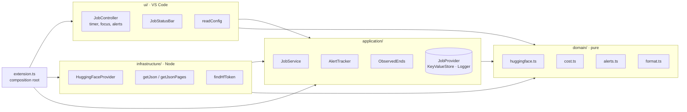

# Architecture

Four layers, the same as Tokenwatch's, so that everything worth testing runs without VS Code and
so that adding a provider (Kaggle next) touches one file in each of two layers.

| Layer | Holds | May import |
| --- | --- | --- |
| `domain/` | Types, response parsing, phases, cost, spend totals, alert rules, display text | nothing outside `domain/` |
| `application/` | One refresh (`JobService`), once-only alerts (`AlertTracker`), observed end times (`ObservedEnds`), the ports | `domain/` |
| `infrastructure/` | HTTPS with pagination, the token lookup, the Hugging Face provider | `application/`, `domain/` |
| `ui/` | Status bar, timer, notifications, commands, settings | `application/`, `domain/` |

`eslint.config.ts` enforces the table: the lint fails when a layer imports what it may not.

## A refresh

1. `JobController` asks `JobService.refresh` with the current settings.
2. `HuggingFaceProvider` finds the token (`HF_TOKEN`, then the `hf` CLI's token file), resolves
   the account once with `whoami-v2` unless `jobwatch.namespace` is set, and lists
   `/api/jobs/{namespace}`, following `Link: rel="next"` pages on the same host only.
3. Prices come from `/api/jobs/hardware`, cached for six hours.
4. `ObservedEnds` records every running job's sighting and, for a finished job the provider gave
   no running time or end time, substitutes the last sighting as its end.
5. `priceJobs` attaches phase, running time and estimated cost; `spendOf` totals them;
   `alertsFor` lists every alert that applies; `AlertTracker` keeps only the new ones.
6. The controller draws the status bar, raises at most three notifications, and schedules the
   next refresh: 60 s while anything is active, 600 s otherwise, at least 300 s after a 429.

## How cost is estimated

`running seconds ÷ seconds per unit × unit price`, with the unit and price from Hugging Face's
own list (per minute today). Running time is:

| Job | Running time |
| --- | --- |
| running | start to now (the reported duration lags) |
| finished, reported | the provider's `runningSecs` |
| finished, with start and end | end minus start |
| cancelled, seen running | last sighting minus start: a lower bound, within one refresh |
| cancelled, never seen | unknown; bounded above by its `timeout` at the listed price |

A job counts towards the day and month it started in, local time. The tooltip says these are
estimates and the invoice is the authority.

## First run

`AlertTracker` treats the first refresh it has ever stored as a baseline: every alert that
applies is recorded as seen and none is shown. Without that, installing Jobwatch on an account
with a history would raise a notification for every past job.

## Adding a provider

Implement `JobProvider` (`listJobs`, `listHardware`) in `infrastructure/`, with a pure parser in
`domain/`, and choose it in `extension.ts`. Nothing in `application/` or `ui/` changes.

## Providers considered

**Kaggle, checked 2026-10-09 and not built.** The CLI's API (`kaggle kernels list --mine`,
`kaggle kernels status`) was probed against a real account:

| Needed | What Kaggle offers |
| --- | --- |
| Which runs are active | A list of your kernels by last run date, but 2 of 20 private notebooks came back as `[Private Notebook]` with no slug, so they cannot be watched |
| Status | One request per kernel; works with the slug Kaggle derives from the title (10 of 11), not the `id` in `kernel-metadata.json`. A kernel pushed but never run, for example refused for quota, answers 404 |
| Cost | None: Kaggle is free |
| Run duration | Not exposed; only the last run's start time |
| Remaining GPU quota | Not exposed; it shows only as a refused push |

What remained, a status light and completion alerts for a few recent kernels, did not justify a
provider. Revisit if Kaggle adds quota or duration to its API.
